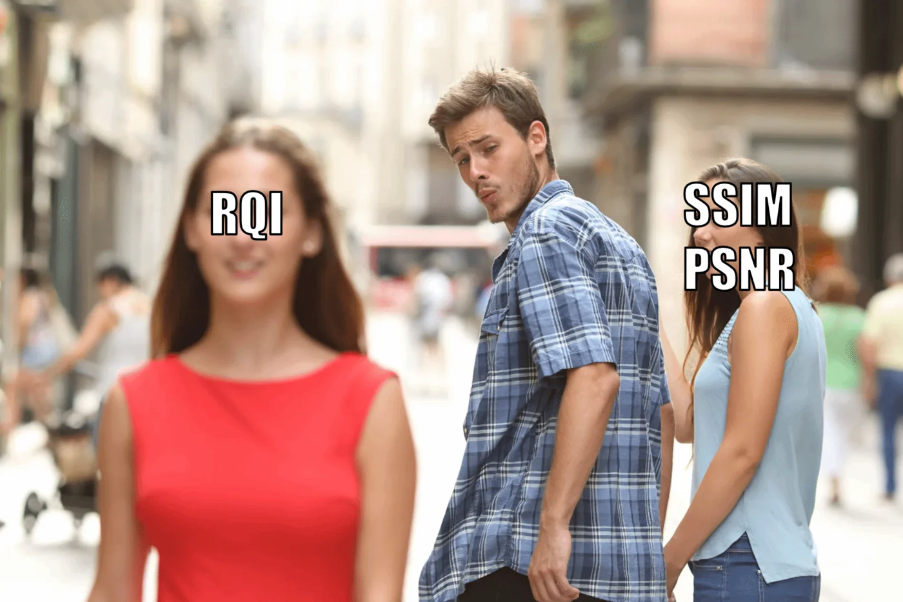

# RQI (Relative Quality Index)

**Official code for the CVPR 2026 paper:**
> **Bridging the Perception Gap in Image Super-Resolution Evaluation**

📄 [arXiv](https://arxiv.org/abs/2503.13074) &nbsp;|&nbsp; 🌐 [Project Page](https://color.cvc.uab.cat/rqi/)

---

We investigate whether long-standing image quality metrics can actually evaluate modern SR models, and introduce RQI — a learned metric that better aligns with human preference for SR model evaluation.

---

> **Notice:** RQI is trained on general distorted image data (the [PIPAL dataset](https://github.com/HaomingCai/PIPAL-dataset)), making it potentially applicable beyond SR. We encourage exploration of its useages in other image quality assessment tasks.

## 1. Quick Use

Install via pip:

```bash
pip install rqi-iqa
```

You can then use RQI by a few lines:

```python
from rqi import RQI

model = RQI(pretrained=True)

# score = model(test_image, gt_image)
score = model("imgs/0801_BSRGAN.png", "imgs/0801_GT.png")
```

**RQI accepts various input formats:** `str` (image path), `PIL.Image`, `np.ndarray`, or `torch.Tensor`

> ⚠️ **RQI is assymetic**: the **first** argument is the image to be evaluated; the **second** argument is the reference (ground truth) image.

**Output:** A score in `[0, 1]` — higher means better image quality.

---

## 2. For Development

### 2.1 Setup

Requirements: Python >= 3.8

```bash
git clone https://github.com/CVC-Color/rqi
cd rqi
pip install -r requirements.txt
```

### 2.2 Benchmark Evaluation

We provide a script for testing RQI on the SRIQA-Bench dataset:

```bash
python scripts/test_SRIQA.py
```

This script reports:

- Mean SRCC / PLCC over single images
- Overall SRCC / PLCC across the dataset

**Performance**

Our provided pretrained weights achieve better performance than reported in the paper.

| Metric       | Paper | Provided Weights |
|:-------------|:-----:|:----------------:|
| SRCC         | 0.733 | **0.780**        |
| PLCC         | 0.739 | **0.795**        |
| SRCC (subset)| 0.609 | 0.590            |
| PLCC (subset)| 0.564 | **0.565**            |

### 2.3 Using RQI as a Training Loss

> 🚧 **TODO**

 
---
 
## Citation
 
If you find this work useful, please consider citing:
 
```bibtex
@inproceedings{su2026rqi,
  title     = {Bridging the Perception Gap in Image Super-Resolution Evaluation},
  author    = {Su, Shaolin and Rocafort, Josep M. and Xue, Danna and
               Serrano-Lozano, David and Sun, Lei and Vazquez-Corral, Javier},
  booktitle = {Proceedings of the IEEE/CVF Conference on Computer Vision
               and Pattern Recognition (CVPR)},
  year      = {2026}
}
```

 


---

## Acknowledgement
 
This work was supported by grants PID2021-128178OB-I00 and PID2024-162555OB-I00 funded by MCIN/AEI/10.13039/501100011033 and ERDF "A way of making Europe", the Generalitat de Catalunya CERCA Program, the grant Càtedra ENIA UAB-Cruïlla (TSI-100929-2023-2), and the 2025 Leonardo Grant for Scientific Research and Cultural Creation from the BBVA Foundation. Shaolin Su was supported by the HORIZON MSCA Postdoctoral Fellowship (project number 101152858). David Serrano-Lozano was supported by the FPI grant from the Spanish Ministry of Science and Innovation (PRE2022-101525). Lei Sun was partially funded by the Ministry of Education and Science of Bulgaria's support for INSAIT and by the European Union's Horizon Europe programme (grant agreement 101168521).
 